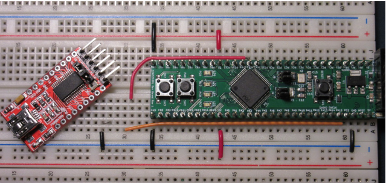

# Lab 0
## Setting up the Microcontroller

## Table of Contents
<br>

| Step | Description | Points |
|------|-------------|--------|
| 1 | Place the Development Board on a Breadboard | 10 |
| 2 | Install VScode and PlatformIO | 10 |
| 3 | Configure PlatformIO for your board | 20 |
| 4 | Writing microcontroller code in C | 20 |
| 5 | Build and Debug a Project | 20 |
| 6 | Set up and interact with a Serial Port | 20 |
| &nbsp; | Total: | 100 |
<script>
    document.querySelector("table").classList.add("toc");
</script>
<br>

## Instructional Objectives
- To become familiar with the EE 69 laboratory, policies, lab stations, and equipment.
- To get hands-on experience with the STM32F0DISCOVERY board, its accompanying components, and the PlatformIO IDE in VScode that you will use all semester.

```
attention_block
<span style="text-align: center">
<span style="color: red; font-weight: 700; font-size: xx-large">STOP.</span>

This is an example of a note designed to get your attention. If you see this, read it carefully.

**Make sure that you read this document in full. There are two ways in this lab to destroy your development board.**

Some of you may have come directly to this lab without starting on <a href="../../submit/?item=hw0">homework 0</a>. You need to finish that first before completing any of the subsequent lab assignments.
</span>
```  

## Welcome to ECE 36200!

In ECE362, you will learn fundamentals of microcontrollers, including their operation, and usage. In addition to the lecture portion of the course, students are expected to complete a series of lab experiments using a microcontroller and supporting IDE.  Computers and measurement equipment are provided in the course laboratory facilities to assist students in completing labs, however, the course has also been designed to allow students to perform experiment exercises on their own computers at home or elsewhere. Instructions provided in this lab document serves as a guide to setting up the microcontroller development environment used in ECE362 to provide a consistent user experience between home and the laboratory.

Lab 0 will have you set up your brand new STM32F0DISCOVERY board that you should have received at the beginning of lab.  If you have not yet received it, please ask a TA or lab coordinator.

If at any point you need help, you can add yourself to the lab queue as you did in ECE 270 via [labutils](https://engineering.purdue.edu/ece362/lab/labutils).

```
attention_block
Please keep in mind the food-and-liquids policy of the lab, which is to bring absolutely no food or liquid with you to your lab sessions.  **Failure to follow this rule will result in a zero for the lab currently running in that week.**  

This rule applies no matter what is happening in lab, be it your lab session, someone else's, or an open lab session.  If you must bring a bottle or other such container, please drop it off at the sink in EE 69 by going through the back door of the lab, with the sink on your right as you enter.  
```  

## Step 1: Place the Development Board on a Breadboard

Open your ECE 362 lab kit and find the STM32F091RCT microcontroller development board. It should look like the one in the image below.

<div class="center">
    
</div>

Your ECE Master/Mini kit has a large, four-panel breadboard similar to the one pictured below.    Place the devboard so that it is on the bottom of the second panel, shown below.  (You can ignore your instructor's mess on the top two panels!)

<div class="center">
    
</div>

Typically, these will be a little hard to get in there, but you should not have to remove it once it’s in there. To prevent damage to the board, press down on the buttons. Do not apply force to anything else, as parts of the board are delicate and may become damaged. When inserting, make sure there are two holes on either side of the development board to leave room to plug in peripherals. Next, connect the USB programmer (black STLINK-v2 USB connector with a light on it, pictured below) to the devboard.

<div class="center">
    
</div>

It is important that this programmer only ever gets connected to the black header on the side of the devboard. If you manage to place it on the exposed pins on the long sides of the devboard, you will irreversably damage the development board. After plugging in the programming side to the devboard , you should see a red and a green LED light up. If it does not light up, unplug the programmer and call over a TA so they can take a look at it.

## Step 2: Install VScode and PlatformIO

As mentioned above, these labs are entirely doable at home as they are in lab.  For applications that require looking at an oscilloscope, you may want to use an AD2 from the ECE shop.  Make it a habit to look ahead at labs so that you know when you may need one.  

If you haven't already used it for a prior class, download Visual Studio Code (commonly referred to as VScode) from https://code.visualstudio.com/.  

Once you have downloaded and installed VScode, open it up and click on the Extensions icon on the left side of the window.  Search for PlatformIO and install the PlatformIO IDE extension.  This will allow you to use PlatformIO from within VScode.  Once you have installed the extension, reload the VScode window so that the extension starts setting itself up.  Once it's done, click the newly added PlatformIO logo in the left sidebar.

<div class="center">
    <video src="vscode-platformio.webm" style="width: 90vw; max-width: 800px" controls></video>
</div>

If it shows the sidebar, it should be good to go.  Click on PIO Home > Open in the left sidebar to show the main window.

## Step 3: Configure PlatformIO for your board

In the PlatformIO IDE window that appears, click New Project.  In the window that appears, type:

- lab0 as the project name;
- ST Nucleo F091RC as the board, and;
- CMSIS as the framework.

You can pick the default location if you wish, but make sure to hover over the Help icon to keep track of where it is.  We'll have you back up your code so that you can keep track of it more easily.  Click Finish to create the project.  

It will take a while to download all the tools for you to use.  Once it is complete, it will ask you to restart VScode.  When you do so, the window will refresh, and you'll see whatever file you had open, along with the PlatformIO Home page.  Close the home page tab.

The `platformio.ini` configuration file specifies how your code should be compiled, with any optional code libraries that you'd like to add, and how to take the resulting binary and flash it to your microcontroller, which typically involves writing that binary file to a specific portion of your microcontroller's flash memory.  When your microcontroller turns on, it reads the program from that part of memory, and starts executing it.  

We'll change this configuration file to include some course-specific settings that we've worked out for you already.  Change the contents as follows (leave the comment block as-is - you may find it helpful when you're adding your own settings):

```ini
[env:nucleo_f091rc]
platform = ststm32
board = nucleo_f091rc
framework = cmsis
upload_command = ${platformio.packages_dir}/tool-openocd/bin/openocd -f openocd.cfg -c "program .pio/build/nucleo_f091rc/firmware.elf verify reset exit"
debug_server = 
    ${platformio.packages_dir}/tool-openocd/bin/openocd
    -f
    openocd.cfg
build_src_flags = -DSTM32F091 -O0
upload_protocol = stlink
debug_init_break = tbreak main
monitor_speed = 115200
monitor_eol = LF
```

<!--  "${platformio.workspace_dir}/../lib/autotest.o" -->

Next, open your Explorer (it's the top icon with a picture of files on it, or you can press Ctrl-Shift-E), and create a new file called openocd.cfg.  

<div class="center">
    <video src="createfile.webm" style="width: 90vw; max-width: 900px" controls></video>
</div>

In this file, type the following:

```bash
source [find interface/stlink.cfg]
set WORKAREASIZE 0x8000
transport select "hla_swd"
set CHIPNAME STM32F091RCTx
set BOARDNAME genericBoard
# CHIPNAMES state
set CHIPNAME_CPU0_ACTIVATED 1
# Enable debug when in low power modes
set ENABLE_LOW_POWER 1
# Stop Watchdog counters when halt
set STOP_WATCHDOG 1
# STlink Debug clock frequency
set CLOCK_FREQ 8000
# use software system reset
reset_config none
set CONNECT_UNDER_RESET 0
# BCTM CPU variables
source [find target/stm32f0x.cfg]
```

This sets up the OpenOCD debugger to work with your microcontroller.

Next, we'll create a support file called `clock.c` under the `src` folder.  In it, put the following code:  

```c
#include "stm32f0xx.h"
void internal_clock()
{
    /* Disable HSE to allow use of the GPIOs */
    RCC->CR &= ~RCC_CR_HSEON;
    /* Enable Prefetch Buffer and set Flash Latency */
    FLASH->ACR = FLASH_ACR_PRFTBE | FLASH_ACR_LATENCY;
    /* HCLK = SYSCLK */
    RCC->CFGR |= (uint32_t)RCC_CFGR_HPRE_DIV1;
    /* PCLK = HCLK */
    RCC->CFGR |= (uint32_t)RCC_CFGR_PPRE_DIV1;
    /* PLL configuration = (HSI/2) * 12 = ~48 MHz */
    RCC->CFGR &= (uint32_t)((uint32_t)~(RCC_CFGR_PLLSRC | RCC_CFGR_PLLXTPRE | RCC_CFGR_PLLMUL));
    RCC->CFGR |= (uint32_t)(RCC_CFGR_PLLSRC_HSI_DIV2 | RCC_CFGR_PLLXTPRE_HSE_PREDIV_DIV1 | RCC_CFGR_PLLMUL12);
    /* Enable PLL */
    RCC->CR |= RCC_CR_PLLON;
    /* Wait till PLL is ready */
    while((RCC->CR & RCC_CR_PLLRDY) == 0);
    /* Select PLL as system clock source */
    RCC->CFGR &= (uint32_t)((uint32_t)~(RCC_CFGR_SW));
    RCC->CFGR |= (uint32_t)RCC_CFGR_SW_PLL;
    /* Wait till PLL is used as system clock source */
    while ((RCC->CFGR & (uint32_t)RCC_CFGR_SWS) != (uint32_t)RCC_CFGR_SWS_PLL);
}
```

This code initializes an internal PLL, or phase-locked loop, to make use of the external crystal on our custom STM32 boards to generate a 48MHz clock.  This is the maximum clock speed of the STM32F0 series, and we'll use it for our labs.  We'll also use this code to initialize the clock in our labs, so it's good to have it in a separate file.  PlatformIO will automatically include all your source code for you, as long as it is in the `src` folder.

## Step 4: Writing microcontroller code in C

We've now configured our project to use the STM32F0DISCOVERY board, and we've added code to initialize a faster clock.  Let's now write some code to test it out.

Under the `src` folder, create a new file called `main.c`.  In it, write a `main` function in C to create two `int` variables `x` and `y`, and in an infinite for loop, increment `x` until it reaches 10.  When `x` reaches 10, increment `y` and reset `x` to 0.  (Just a silly example to test our debugger).  Press Ctrl-S to save.

(We won't call the `internal_clock` function yet - we're just testing the debugger for now.)

## Step 5: Build and Debug a Project

Once saved, go back to the PlatformIO tab, and click the Upload option under `nucleo_f091rc` > General.  This will automatically build your code for you, and flash it to your microcontroller.  If you see a textbox appear asking about CMakeLists.txt, you can hit Escape to get rid of it. 


If you see the following in your terminal:

```
** Programming Finished **
** Verify Started **
** Verified OK **
** Resetting Target **
Info : Unable to match requested speed 1000 kHz, using 950 kHz
Info : Unable to match requested speed 1000 kHz, using 950 kHz
shutdown command invoked
```

Your microcontroller should have flashed correctly!  Great work!

With a microcontroller, however, it can be hard to see what's going on under the hood.  This is a great opportunity to try out debugging, which allows us to step through each line of code and track what our variables contain, to ensure our code is working as we intend.  You'll do this a lot when you configure *peripherals*, which are devices that come with your microcontroller to do things like read from sensors, or control motors.  For now, we'll use the debugger to inspect our two variables `x` and `y`.

Debugging does the same process as flashing your microcontroller, but instead of releasing control over the microcontroller, it tells it to pause a certain point in your code, typically the beginning of your `main` function.  You can then either continue to run through the code normally, or set up **breakpoints**, which are markers in your code to tell the debugger to pause at that specific point if you continue the program in debug mode. 

Here's the debugging process:

<div class="center">
    <video src="debugging.webm" style="width: 90vw; max-width: 1200px" controls></video>
</div>

To start debugging, press F5 (or Fn+F5, depending on your keyboard Fn lock), or click Debug > Start Debugging under the Quick Access sidebar on the PlatformIO tab.  You'll see the microcontroller be flashed again, but this time, a Debug Console will appear, and VScode will first take you to the Reset_Handler, before taking you to the first line of your `main` function.  By default, your debugger will pause here.

Look for the (very small) new panel that has been added to the top-center of your VScode window: 

<div class="center">
    
</div>

In order, we have:
- Continue (F5) - Continue running the program until the next breakpoint, or until the program ends.
    - Use this for when you want to run the program normally, or until the first breakpoint you've set.
    - This button changes to a Pause button when the program is running.
- Step Over (F10) - Run the next line of code, but don't step into any functions that may be called.
    - Use this for when you want to skip over a function call, but still want to see what the function does.
- Step Into (F11) - Run the next line of code, and step into any functions that may be called.
    - Use this for when you want to see what a function does.
- Step Out (Shift+F11) - Run the rest of the current function, and return to the calling function.
    - Use this when you've reached a line inside the function that you wanted to check, and now want to return to the calling function.
- Restart (Ctrl+Shift+F5) - Restart the program from the beginning.
- Stop (Shift+F5) - Stop the program.

Click the Step Over button, which you'll use most of the time, to execute the current line and move to the next one.  Notice that `x` and `y` appear as local variables on the left, and when you run a line that affects `x`, the value of `x` updates.  Nifty!  

Keep stepping over (slowly) and you'll see the values update as the program progresses.  If you haven't thought it already, you may realize eventually that this gets very tedious.  If you were running the debugger to get to some distant part of your code, having to step over manually would get boring very quickly.  On the other hand, clicking Continue would only run to the end of your code.  This is where we add breakpoints.

Note in the video that we set a breakpoint on the line where `y` gets incremented.  This is an example of such a scenario where you have a longer piece of code to execute before the line you want to check.  Set your breakpoint by adding the red dot next to the line, and then click Continue.  The debugger will run until the breakpoint, and then pause.  You can then step over to see the value of `y` increment.  Very nifty!  

You can also hover over the variable to see its value, or add it to your Watch list to keep track of it.  You can even add expressions combining different variables!  Keep in mind that it cannot "watch" variables that are not in the current scope, so if you add variables from a function, and then return, you won't see those variables anymore.  Nonetheless it's a good option for global variables.

<div class="center">
    <video src="gdb.webm" style="width: 90vw; max-width: 700px" controls></video>
</div>

## Step 6: Set up and interact with a Serial Port

Now that you know how to build and debug a program, let's now try out a *peripheral*.  A peripheral is a part of a microcontroller that can interface with the outside world, and is capable of operating independently of the *microprocessor* on the microcontroller.

UART, or universal asynchronous receiver/transmitter, is a very common peripheral that was used by computers since the 1970s.  We don't see them much these days, but it remains the prime example of bidirectional communication between two devices.  It's also a great way to get started with microcontroller peripherals, as it's very simple to use.

Your microcontroller has a UART peripheral that can be used to act as a "transciever" - transmitter + receiver.  We'll configure it to wait for data to be **received**, and then **transmit** the same data back.  

Modern computers don't have a UART peripheral anymore, so we'll use a chip in your 362 kit called the FTDI USB-UART interface.  This allows us to add a UART peripheral to our computers by connecting it to a USB port.  

<div class="center">
    
</div>

The very first thing you must do before you connect your red FTDI to your breadboard is ensure that it is set to 3.3V mode.  **If you don't, you will destroy your microcontroller**.  To do this, move the header (orange, yellow, or black cap on the pins just above the main pins on the bottom of the chip) to the 3V position, such that it connects the center and rightmost pin.  **Before you plug this in, call a TA over and make sure it is on the correct position**.  Then:

- Place the pins of the serial adapter into the breadboard.
- Connect Rx (Pin 2) of the serial adapter to PC12 of the devboard.
- Connect Tx (Pin 3) of the serial adapter to PD2 of the devboard.
- Connect GND on the devboard to the breadboard’s ground rail (blue).
- Connect GND (Pin 6) of the serial adapter to the breadboard’s ground rail (blue).
- Connect CTS (Pin 5) of the serial adapter to the breadboard’s ground rail (blue).

You can check to see that you've wired your FTDI chip correctly by looking at the pins on the bottom of the chip.  The pinout is shown below:

<div class="center">
    
</div>

After this is wired properly, **check one last time to make sure the adapter is in 3V mode**. Then, connect the FTDI chip to your computer with the USB cable in your lab kit.

Once the hardware is in place, we'll use the following code to test it out:

```c
#include "stm32f0xx.h"
void internal_clock();
void setup_serial(void)
{
    RCC->AHBENR |= 0x00180000;
    GPIOC->MODER  |= 0x02000000;
    GPIOC->AFR[1] |= 0x00020000;
    GPIOD->MODER  |= 0x00000020;
    GPIOD->AFR[0] |= 0x00000200;
    RCC->APB1ENR |= 0x00100000;
    USART5->CR1 &= ~0x00000001;
    USART5->CR1 |= 0x00008000;
    USART5->BRR = 0x340;
    USART5->CR1 |= 0x0000000c;
    USART5->CR1 |= 0x00000001;
}
int main(void)
{
    internal_clock();
    setup_serial();
    while(1) {
        if ((USART5->ISR & USART_ISR_RXNE))  // if receive buffer has some data in it
            USART5->TDR = USART5->RDR;       // copy that data into transmit buffer.
    }
}
```

Make sure to replace your `main` function from earlier.

Go to the PlatformIO tab again, and this time, click 'Upload and Monitor' instead of 'Upload'.  This time, your code will flash, and a serial console will appear in the same output tab.  Try typing characters into this console - you should see the characters appear one after the other.  That indicates your STM32 and its UART are working and communicating as expected!

If you have more than one serial device connected, you may be asked to pick which one to use.  Pick the one that has "FTDI USB to UART" or similar in its name.

```
attention_block
Show your TA your working serial connection to get fully checked off for this lab.
```  

## Sign Your Breadboard

If you haven't done so already, your TA will hand you a silver sharpie that so that you can write your username at the top of the breadboard.  If the breadboard was used by someone else whose username is on it, cross out the previous username. 

## Lab Station Clean-up

At this point, you are free to leave. Please make sure to close all windows, log out of the machine (click on your name on the top bar, and click Log Out, or similar), take all your belongings with you, and exit the lab. You must perform this clean-up procedure in every lab, or you will lose all points on the lab. 